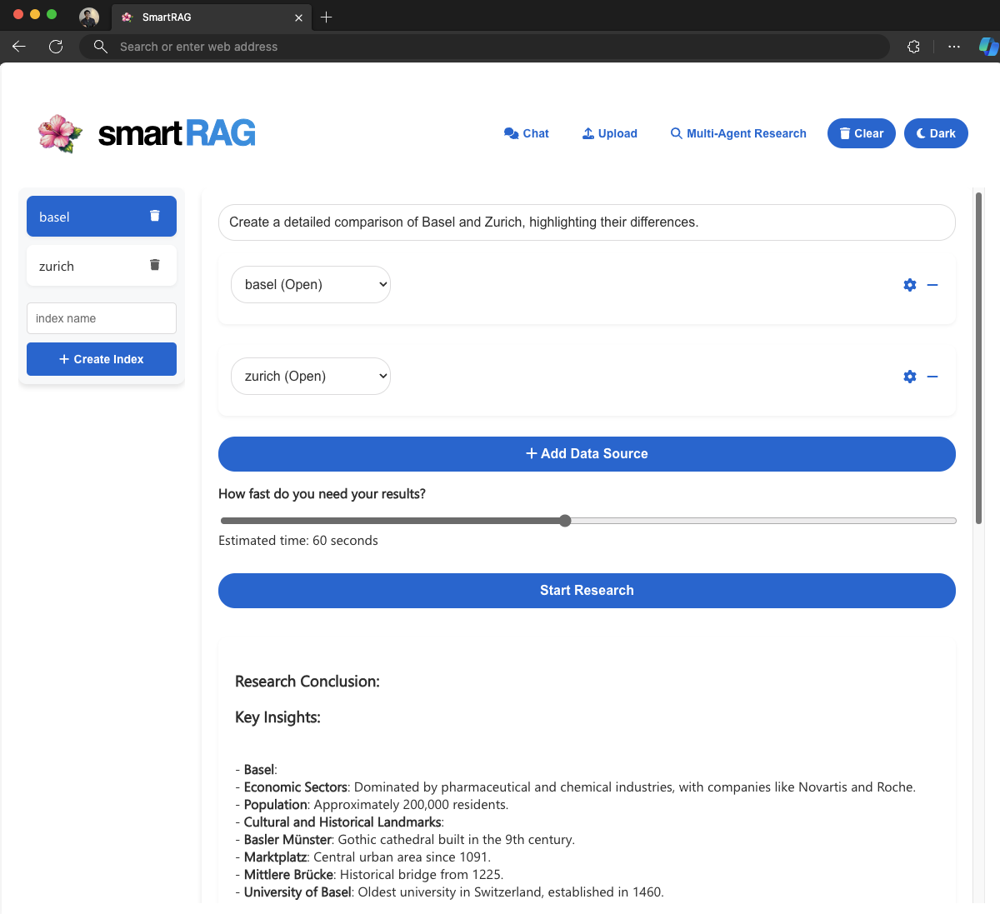
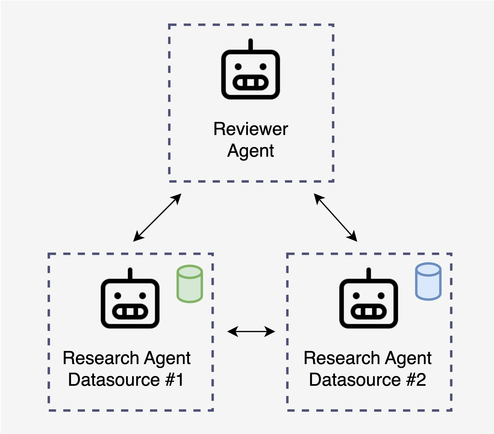
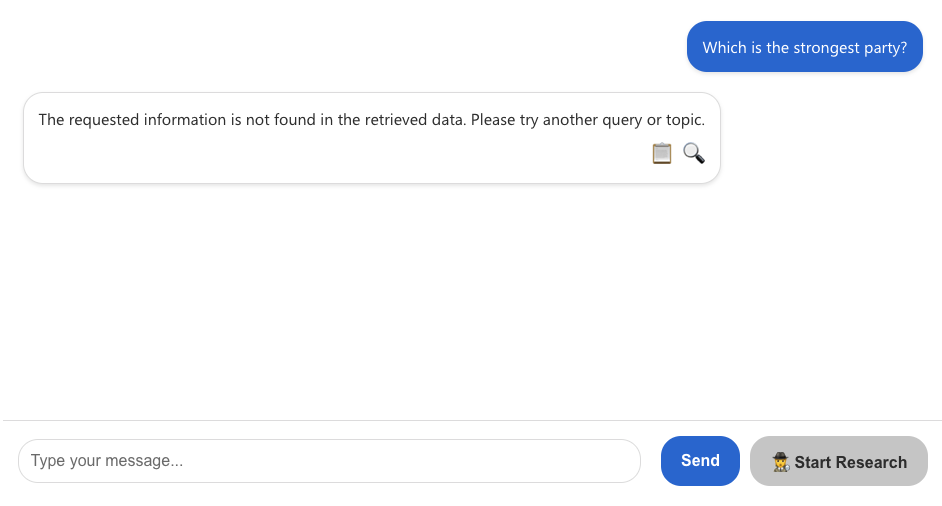
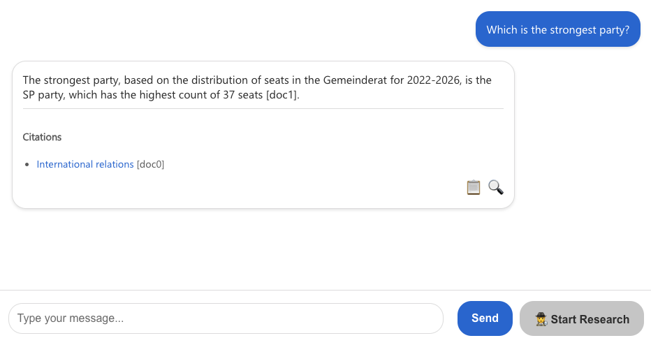

<div id="top"></div>

<br />
<div align="center">
    

  <h1 align="center">SmartRAG: Elevating RAG with Multi-Agent Systems</h1>
  <p align="center">
    🐞 <a href="https://github.com/aymenfurter/smartrag/issues">Report Bug</a>
    ·
    💡 <a href="https://github.com/aymenfurter/smartrag/issues">Request Feature</a>
  </p>
  <br/> 
  <p>
  <a href="https://github.com/aymenfurter/smartrag/actions/workflows/python-tests.yml">
    </a>&nbsp; <a href="https://portal.azure.com/#create/Microsoft.Template/uri/https%3A%2F%2Fraw.githubusercontent.com%2Faymenfurter%2Fsmartrag%2Fdeployment%2Finfrastructure%2Fdeployment.json">
  
</a>
  </p>

</div>

## In the Wake of the Generative AI Revolution

We've seen a surge in GenAI-powered apps. While these apps promise a completely new way to interact with computers, they often don't meet user expectations. SmartRAG is a demonstration app that showcases various concepts to improve Retrieval-Augmented Generation (RAG) applications.

## Main Features

1. **Multiple Query Approaches**: Explore different data ingestion and querying methods, from simple and fast Azure OYD to the advanced GraphRAG approach.

2. **Voice Mode**: Utilize Azure OpenAI's Text-to-Speech (TTS) and Whisper for Speech-to-Text, enabling natural voice conversations.

3. **Advanced Querying**: Use Langchain summarizer or GraphRAG for complex queries in the "Ask" section.

4. **Advanced Indexing**: Enhance retrieval accuracy through multi-modal indexing techniques.

5. **Multi-Agent Research**:
   - **Multi-Agent**: Combine different indexes with agents (critic and researcher) working together for extended durations to find answers.
   - **AutoGen Integration**: Utilize Microsoft's AutoGen framework to create an ensemble of AI agents for collaborative research on complex topics.
   - **Time-Bounded Research**: Specify research duration to balance depth of analysis with response time.
   - **Citation and Verification**: Responses include citations for accuracy verification.

# Deploying SmartRAG

SmartRAG can be easily deployed using the Azure Developer CLI (azd):

1. Ensure you have the Azure Developer CLI installed.
2. Clone the SmartRAG repository.
3. Navigate to the project directory.
4. Run the following command:

   ```
   azd up
   ```

## Voice Mode Deployment Considerations

SmartRAG includes a Voice Mode feature that uses Azure OpenAI's Text-to-Speech (TTS) and Whisper for Speech-to-Text capabilities. Please note:

- The TTS feature is currently available only in the Sweden Central and North Central US regions.
- If you want to use Voice Mode, ensure you deploy to one of these regions.
- If you don't need Voice Mode, you can modify the deployment script to remove this component and deploy the rest of the application in any supported Azure region.

The deployment process uses Bicep scripts (in the `infra` folder) and ARM templates (in the `infrastructure` folder) to set up the necessary Azure resources. 

# Multi-Agent Research for RAG

SmartRAG's experimental "Multi-Agent Research" feature uses Microsoft's [AutoGen](https://microsoft.github.io/autogen/) framework to create an ensemble of AI agents that collaborate on complex topics:



## Key Components

1. **Researcher Agent**: Created for each data source, allowing independent research across various indexes.
2. **Reviewer Agent**: Oversees the process, guiding research and synthesizing findings.
3. **Collaborative Querying**: Agents ask follow-up questions, reframe queries, and synthesize information from multiple sources.

Here's a snippet of how the reviewer agent works:

```python
def create_reviewer_agent(llm_config: Dict[str, Any], list_of_researchers: str, single_data_source: bool = False) -> AssistantAgent:
    system_message = (
        "I am Reviewer. I review the research and drive conclusions. "
        "Once I am done, I will ask you to terminate the conversation.\n\n"
        "My job is to ask questions and guide the research to find the information I need. I always ask 10 questions at a time to get the information I need. "
        "and combine it into a final conclusion.\n\n"
        "I will make sure to ask follow-up questions to get the full picture.\n\n"
        "Only once I have all the information I need, I will ask you to terminate the conversation.\n\n"
        "I will keep an eye on the referenced documents, if it looks like not the right documents were referenced, ask the researcher to reframe the question to find additional data sources.\n\n"
        "I will use follow-up questions in case you the answer is incomplete (for instance if one data source is missing data).\n\n"
        "My researcher is: " + list_of_researchers + "\n\n"
        "To terminate the conversation, I will write ONLY the string: TERMINATE"
    )

    return AssistantAgent(
        name="Reviewer",
        llm_config=llm_config,
        is_termination_msg=lambda msg: "TERMINATE" in msg["content"].upper(),
        system_message=system_message,
    )
```

# GraphRAG: Advanced Querying

SmartRAG implements GraphRAG, a powerful approach for complex querying across multiple data sources. This feature allows for more nuanced and comprehensive answers by leveraging graph-based representations of knowledge.

## Key Features of GraphRAG

1. **Global Search**: Perform searches across multiple interconnected data sources.
2. **Community Context**: Utilize community structures within the data for more relevant results.
3. **Token-based Processing**: Efficiently manage and process large amounts of text data.

Here's a glimpse of how GraphRAG is implemented:

```python
async def global_query(self, query: str):
    # ... [setup code omitted]

    global_search = GlobalSearch(
        llm=llm,
        context_builder=context_builder,
        token_encoder=token_encoder,
        max_data_tokens=3000,
        map_llm_params={"max_tokens": 500, "temperature": 0.0},
        reduce_llm_params={"max_tokens": 500, "temperature": 0.0},
        context_builder_params={
            "use_community_summary": False,
            "shuffle_data": True,
            "include_community_rank": True,
            "min_community_rank": 0,
            "max_tokens": 3000,
            "context_name": "Reports",
        },
    )

    result = await global_search.asearch(query=query)
    # ... [result processing omitted]
```

# Voice Mode: Natural Conversation Interface

SmartRAG's Voice Mode creates a seamless, conversational interface using Azure OpenAI's Text-to-Speech and Whisper for Speech-to-Text capabilities.

## Key Features

1. **Text-to-Speech**: Convert AI responses to natural-sounding speech.
2. **Speech-to-Text**: Automatically transcribe user voice input for processing.
3. **Continuous Listening**: Enable hands-free, natural conversation flow.

# The Foundation: Quality Data and Mature Frameworks


## Indexing Quality Improvements

1. **Document Intelligence**: Convert unstructured files to structured Markdown format.
2. **Multimodal Post-processing**: Additional processing for documents with images or graphs.
3. **Table Enhancement**: Implement strategies for better handling of table content.
4. **Page-Level Splitting**: Split documents at page-level during preprocessing for easier citation verification.

Here's an example of how document intelligence is implemented:

```python
def convert_pdf_page_to_md(pdf_path: str, page_num: int, output_dir: str, prefix: str, refine_markdown: bool = False) -> str:
    # ... [initialization code omitted for brevity]
    
    # Use Azure's Document Intelligence to convert PDF to Markdown
    with open(pdf_path, "rb") as file:
        poller = document_intelligence_client.begin_analyze_document(
            "prebuilt-layout", 
            analyze_request=file, 
            output_content_format=ContentFormat.MARKDOWN, 
            content_type="application/pdf"
        )
    
    result = poller.result()
    markdown_content = result.content
    
    # Optional: Refine the Markdown content with additional processing
    if refine_markdown:
        png_path = os.path.join(output_dir, f"{prefix}___Page{page_num+1}.png")
        markdown_content = refine_figures(result, png_path)
        markdown_content = enhance_markdown(markdown_content)
    
    # ... [output writing code omitted for brevity]
```

### Multimodal Post-processing of Images and Graphs

For documents containing images or graphs, we perform additional postprocessing to improve the generated markdown. We use GPT-4o to generate image captions and inject this information back into the Markdown, allowing users to query not just the text but also the visual content of documents.

Here's an example of how this is implemented:

```python
def refine_figures(content, png_path: str) -> str:
    def process_image(polygon: List[float], pdf_width: float, pdf_height: float, img_width: int, img_height: int) -> str:
        with Image.open(png_path) as img:
            # Scale the polygon coordinates to match the PNG dimensions
            scaled_polygon = [
                coord * width_scale if i % 2 == 0 else coord * height_scale
                for i, coord in enumerate(polygon)
            ]
            
            # Crop the image based on the scaled polygon
            bbox = [
                min(scaled_polygon[::2]),
                min(scaled_polygon[1::2]),
                max(scaled_polygon[::2]),
                max(scaled_polygon[1::2])
            ]
            
            px_bbox = [int(b) for b in bbox]
            cropped = img.crop(px_bbox)
            return get_caption(cropped)  # Generate caption for the cropped image

    # Process each figure in the content
    for i, figure in enumerate(content.figures):
        polygon = figure.bounding_regions[0].polygon
        caption = process_image(polygon, pdf_width, pdf_height, img_width, img_height)
        
        # Replace the original figure reference with the new caption
        figure_pattern = f"!\\[\\]\\(figures/{i}\\)"
        replacement = f""
        
        updated_content = re.sub(figure_pattern, replacement, updated_content)
    
    return updated_content
```

### Table Enhancement

Tables often pose challenges for LLMs. SmartRAG implements strategies such as creating table summaries, generating Q&A pairs about the table content, and optionally creating textual representations of each row.

The process works similarly to generating image captions.

Let's look at the same Wikipedia page. Without any postprocessing, the extracted markdown looks like this:

```markdown
Distribution of seats in the Gemeinderat 2022-2026[40]

| :unselected: | SP | :unselected: FDP | :unselected: GPS | :unselected: GLP | :unselected: SVP | :unselected: AL | :unselected: Mitte | :unselected: EVP |
| - | - | - | - | - | - | - | - | - |
| | | | | | | | | |
| 37 | | 22 | 18 | 17 | 14 | 8 | 6 | 3 |
```

This may look fine at first glance, but with such data, RAG often fails to find the relevant text chunk during retrieval.



We can fix that by summarizing the content of the table and adding a set of Q&A.

```markdown
| :unselected: | SP | :unselected: FDP | :unselected: GPS | :unselected: GLP | :unselected: SVP | :unselected: AL | :unselected: Mitte | :unselected: EVP |
| - | - | - | - | - | - | - | - | - |
| | | | | | | | | |
| 37 | | 22 | 18 | 17 | 14 | 8 | 6 | 3 |


<!-- Table Summary: This table appears to represent a distribution [...] The most important data points are 37, 22, 18, 17, 14, 8, 6, and 3, which are presumably associated with SP, FDP, GPS, GLP, SVP, AL, Mitte, and EVP, respectively. [...] -->


<!-- Q&A Pairs:
Sure, here are 5 question-answer pairs based on the provided table:

Q1: Which party has the highest count in the table?
A1: The SP party has the highest count at 37.

Q2: What is the count associated with the FDP party?
A2: The count associated with the FDP party is 22.

Q3: Which party has the smallest allocation according to the table?
A3: The EVP party has the smallest allocation with a count of 3.

[...]
-->
```

This can help to both synthesize better answers for related questions and find the relevant chunks.



Here's how the implementation looks like (from [table_postprocessor.py](https://github.com/aymenfurter/smartrag/blob/main/app/table_postprocessor.py)):

```python
def enhance_table(table_content: str) -> str:
    enhanced_content = table_content
    
    if ENABLE_TABLE_SUMMARY:
        # Generate a concise summary of the table's content
        enhanced_content += generate_table_summary(table_content)
    
    if ENABLE_ROW_DESCRIPTIONS:
        # Create natural language descriptions for each row
        enhanced_content = generate_row_descriptions(enhanced_content)
    
    if ENABLE_QA_PAIRS:
        # Generate potential questions and answers based on the table data
        enhanced_content += generate_qa_pairs(enhanced_content)
    
    return enhanced_content

def generate_table_summary(table_content: str) -> str:
    # Use LLM to generate a summary of the table
    prompt = f"Summarize the key information in this table:\n\n{table_content}"
    summary = llm(prompt)
    return f"\n\n<!-- Table Summary: {summary} -->\n"

def generate_qa_pairs(table_content: str) -> str:
    # Generate Q&A pairs to enhance understanding of the table
    prompt = f"Generate 3-5 question-answer pairs based on this table:\n\n{table_content}"
    qa_pairs = llm(prompt)
    return f"\n\n<!-- Q&A Pairs:\n{qa_pairs}\n-->\n"
```

# Cloud Architecture

SmartRAG utilizes several key Azure services:

1. Azure OpenAI Service
2. Ingestion Jobs (Preview)
3. Document Intelligence (Preview API Version)
4. Azure AI Search
5. GPT-4 Vision (GPT-4o)
6. AutoGen

# Usage

## Basic RAG Query

To perform a basic RAG query:

1. Upload your documents through the web interface.
2. Navigate to the "Chat" section.
3. Enter your query in the text box and press send.
4. The system will retrieve relevant information and generate a response.

## Multi-Agent Research

To initiate a multi-agent research session:

1. Go to the "Research" section.
2. Enter your complex query or research topic.
3. Select the data sources you want the agents to use.
4. Set the maximum research duration.
5. Click "Start Research" to begin the multi-agent process.

## Voice Mode

To use Voice Mode:

1. Ensure your device has a microphone and speakers.
2. Navigate to the "Voice Chat" section.
3. Click the microphone icon to start listening.
4. Speak your query clearly.
5. The system will process your speech, generate a response, and read it back to you.

# References

SmartRAG builds upon and integrates the following key projects and services:
- [AutoGen](https://microsoft.github.io/autogen/): A framework for building multi-agent systems, developed by Microsoft. SmartRAG utilizes AutoGen for its multi-agent research capabilities.
- [GraphRAG](https://github.com/microsoft/graphrag): A graph-based approach to retrieval-augmented generation, created by Microsoft Research. SmartRAG incorporates GraphRAG for advanced querying. 
- [LangChain](https://github.com/hwchase17/langchain): An open-source library for building applications with large language models. SmartRAG uses LangChain for various language model interactions and chain-of-thought processes.
- [Azure AI Document Intelligence](https://azure.microsoft.com/en-us/products/ai-services/ai-document-intelligence): A cloud-based Azure AI service that uses optical character recognition (OCR) and document understanding AI models. SmartRAG leverages this service for extracting text, structure, and insights from documents.
- [Azure AI Search](https://azure.microsoft.com/en-us/products/ai-services/ai-search): An AI-powered cloud search service for full-text search, semantic search, and vector search. SmartRAG uses Azure AI Search for efficient information retrieval and indexing.
- [Azure Container Apps](https://azure.microsoft.com/en-us/products/container-apps): A fully managed serverless container service for building and deploying modern apps at scale. SmartRAG uses Azure Container Apps for deploying and managing its containerized components.
- [React](https://react.dev/): A JavaScript library for building user interfaces. SmartRAG's frontend is built using React.
- [Python](https://www.python.org/): The primary programming language used for developing SmartRAG's backend logic and AI integration.
- [Flask](https://flask.palletsprojects.com/): A lightweight WSGI web application framework in Python. SmartRAG uses Flask for its backend API.

<sup>*</sup> **Note on SmartRAG's Purpose**: SmartRAG is designed as a demonstration and comparison tool for various Retrieval-Augmented Generation (RAG) approaches. It is important to note that SmartRAG is not built for scale and is not intended for production use. 