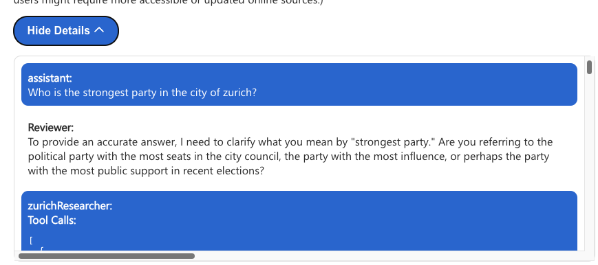

<div id="top"></div>

<br />
<div align="center">
    

  <h1 align="center">Elevating RAG with Multi-Agent Systems</h1>
  <p align="center">
    🐞 <a href="https://github.com/microsoft/custom-monaco-opilot-demo/issues">Report Bug</a>
    ·
    💡 <a href="https://github.com/microsoft/custom-monaco-copilot-demo/issues">Request Feature</a>

  [](https://github.com/aymenfurter/smartrag/actions/workflows/python-tests.yml)
  </p>

</div>

## In the Wake of the Generative AI Revolution

We've seen a surge in GenAI-powered apps. While these apps promise a completely new way to interact with computers, they often don't meet user expectations. Here are my thoughts on improving Retrieval-Augmented Generation (RAG) applications, starting with better indexing and exploring the exciting potential of multi-agent systems. I've also built a demonstration app called "SmartRAG" that showcases these concepts effectively.

### The Foundation: Quality Data and Mature Frameworks

Before we discuss advanced topics like multi-agent systems, it's important to understand that any RAG app is only as good as its retrieval component. This part heavily depends on high-quality data and robust pipelines.

The AI development landscape is evolving rapidly. Frameworks, SDKs, and best practices needed time to mature. I believe we're now at a point where these tools have become more stable and reliable. For example, Microsoft's recent release of Semantic Kernel 1.0 for Java and Python illustrates this maturation process.

### Leveraging Cloud-Native Capabilities

One pitfall I've noticed is that developers may try to reinvent the wheel, creating overly complex solutions from scratch. However, Azure offers robust AI services that can significantly simplify both the development process and overall architecture. By using these native Azure capabilities and combining them with well-crafted & evaluated LLM calls, developers can achieve impressive results with a minimal code base.

### Indexing Quality Improvements: The Key to Effective RAG

To showcase the potential of leveraging Azure services and focusing on indexing improvements, I've developed a sample application called SmartRAG. This application uses Azure OpenAI Service's ingestion job feature, which simplifies the process of ingesting data into AI Search.

Here are some key indexing time improvements I've implemented in SmartRAG:


### 1. **Document Intelligence**: 
We can use Azure's **Document Intelligence** service to convert unstructured files into structured Markdown format. This is crucial because Markdown is ideal for large language models to process. Here's a snippet of how this is implemented via document intelligence (from [doc_intelligence.py](https://github.com/aymenfurter/smartrag/blob/main/app/doc_intelligence.py)): 

```python
def convert_pdf_page_to_md(pdf_path: str, page_num: int, output_dir: str, prefix: str, refine_markdown: bool = False) -> str:
    # ... [initialization code omitted for brevity]
    
    # Use Azure's Document Intelligence to convert PDF to Markdown
    with open(pdf_path, "rb") as file:
        poller = document_intelligence_client.begin_analyze_document(
            "prebuilt-layout", 
            analyze_request=file, 
            output_content_format=ContentFormat.MARKDOWN, 
            content_type="application/pdf"
        )
    
    result = poller.result()
    markdown_content = result.content
    
    # Optional: Refine the Markdown content with additional processing
    if refine_markdown:
        png_path = os.path.join(output_dir, f"{prefix}___Page{page_num+1}.png")
        markdown_content = refine_figures(result, png_path)
        markdown_content = enhance_markdown(markdown_content)
    
    # ... [output writing code omitted for brevity]
```

### 2. Multimodal Post-processing
For documents containing images or graphs, we can perform additional postprocessing to improve the generated markdown. 

Additionally to the markdown, Document Intelligence will provide us with a list of figures with related coordinates:

```
"figures": [
			{
				"id": "",
				"boundingRegions": [
					{
						"pageNumber": 1,
						"polygon": [
							0.4665,
							2.6768,
							1.7342,
							2.6768,
							1.7342,
							2.9049,
							0.4665,
							2.9049
						]
					},
               ...
```

We can cut these out and use GPT-4o to generate image captions, **then inject this information back into the Markdown**. This allows users to query not just the text but also the visual content of documents.

Let's demonstrate this based on an example. 

I've exported the Wikipedia entry of the city of zurich, then analyzed it with Document Intelligence:

 

The markdown of a text that contains an image by default may look something like this:


```markdown
<figure>

</figure>
The city stretches on both sides of the Limmat [...]
```

With the GPT-4o enriched caption, we get a markdown like this:

```markdown
<figure>
![The image shows an aerial view of a city with a prominent river or lake cutting through it, taken from an airplane window. In the foreground, part of the airplane's wing is visible [...]](figures/2)
</figure>
The city stretches on both sides of the Limmat [...]
```

This enables a new range of questions that users can ask, covering also the visual aspect oft he document.

Let's take a look at the [code](https://github.com/aymenfurter/smartrag/blob/main/app/doc_intelligence.py) that enables this.
```python
def refine_figures(content, png_path: str) -> str:
    def process_image(polygon: List[float], pdf_width: float, pdf_height: float, img_width: int, img_height: int) -> str:
        with Image.open(png_path) as img:
            # Scale the polygon coordinates to match the PNG dimensions
            scaled_polygon = [
                coord * width_scale if i % 2 == 0 else coord * height_scale
                for i, coord in enumerate(polygon)
            ]
            
            # Crop the image based on the scaled polygon
            bbox = [
                min(scaled_polygon[::2]),
                min(scaled_polygon[1::2]),
                max(scaled_polygon[::2]),
                max(scaled_polygon[1::2])
            ]
            
            px_bbox = [int(b) for b in bbox]
            cropped = img.crop(px_bbox)
            return get_caption(cropped)  # Generate caption for the cropped image

    # Process each figure in the content
    for i, figure in enumerate(content.figures):
        polygon = figure.bounding_regions[0].polygon
        caption = process_image(polygon, pdf_width, pdf_height, img_width, img_height)
        
        # Replace the original figure reference with the new caption
        figure_pattern = f"!\\[\\]\\(figures/{i}\\)"
        replacement = f""
        
        updated_content = re.sub(figure_pattern, replacement, updated_content)
    
    return updated_content
```

### 3. Table Enhancement
Tables often pose challenges for LLMs. SmartRAG implements strategies such as creating table summaries, generating Q&A pairs about the table content, and optionally creating textual representations of each row.

The process works similarly to generating image captions.

Let's look at the same Wikipedia page. Without any postprocessing, the extracted markdown looks like this:

```markdown
Distribution of seats in the Gemeinderat 2022-2026[40]

| :unselected: | SP | :unselected: FDP | :unselected: GPS | :unselected: GLP | :unselected: SVP | :unselected: AL | :unselected: Mitte | :unselected: EVP |
| - | - | - | - | - | - | - | - | - |
| | | | | | | | | |
| 37 | | 22 | 18 | 17 | 14 | 8 | 6 | 3 |
```

This may look fine at first glance, but with such data, RAG often fails to find the relevant text chunk during retrieval.


We can fix that by summarizing the content of the table and adding a set of Q&A.

```markdown
| :unselected: | SP | :unselected: FDP | :unselected: GPS | :unselected: GLP | :unselected: SVP | :unselected: AL | :unselected: Mitte | :unselected: EVP |
| - | - | - | - | - | - | - | - | - |
| | | | | | | | | |
| 37 | | 22 | 18 | 17 | 14 | 8 | 6 | 3 |


<!-- Table Summary: This table appears to represent a distribution [...] The most important data points are 37, 22, 18, 17, 14, 8, 6, and 3, which are presumably associated with SP, FDP, GPS, GLP, SVP, AL, Mitte, and EVP, respectively. [...] -->


<!-- Q&A Pairs:
Sure, here are 5 question-answer pairs based on the provided table:

Q1: Which party has the highest count in the table?
A1: The SP party has the highest count at 37.

Q2: What is the count associated with the FDP party?
A2: The count associated with the FDP party is 22.

Q3: Which party has the smallest allocation according to the table?
A3: The EVP party has the smallest allocation with a count of 3.

[...]
-->
```

This can help to both synthesize better answers for related questions and find the relevant chunks.


Here's how the implementation looks like (from [table_postprocessor.py](https://github.com/aymenfurter/smartrag/blob/main/app/table_postprocessor.py)):

```python
def enhance_table(table_content: str) -> str:
    enhanced_content = table_content
    
    if ENABLE_TABLE_SUMMARY:
        # Generate a concise summary of the table's content
        enhanced_content += generate_table_summary(table_content)
    
    if ENABLE_ROW_DESCRIPTIONS:
        # Create natural language descriptions for each row
        enhanced_content = generate_row_descriptions(enhanced_content)
    
    if ENABLE_QA_PAIRS:
        # Generate potential questions and answers based on the table data
        enhanced_content += generate_qa_pairs(enhanced_content)
    
    return enhanced_content

def generate_table_summary(table_content: str) -> str:
    # Use LLM to generate a summary of the table
    prompt = f"Summarize the key information in this table:\n\n{table_content}"
    summary = llm(prompt)
    return f"\n\n<!-- Table Summary: {summary} -->\n"

def generate_qa_pairs(table_content: str) -> str:
    # Generate Q&A pairs to enhance understanding of the table
    prompt = f"Generate 3-5 question-answer pairs based on this table:\n\n{table_content}"
    qa_pairs = llm(prompt)
    return f"\n\n<!-- Q&A Pairs:\n{qa_pairs}\n-->\n"
```

### 4. Page-Level Splitting
By splitting documents at the page-level during preprocessing, we can directly open the relevant page when verifying citations. If there is a lot of text on a single page, Azure AI Search will create text chunks within that specific page.

# Multi-Agent Systems for RA


While these indexing improvements significantly enhance the retrieval capabilities of RAG applications, sometimes a single question-answer interaction isn't sufficient for complex queries. This is where multi-agent systems come into play.

I've added an experimental feature to SmartRAG called "Multi-Agent Research". Using Microsoft's [AutoGen](https://microsoft.github.io/autogen/) framework, this feature creates an ensemble of AI agents that collaborate to research more complex topics. Here's how it works:

#### 1. Researcher Agent
The system creates an agent **for each data source**, allowing for independent research across various indexes.

#### 2. Reviewer Agent
A reviewer agent oversees the process, guiding the research and synthesizing the findings. This agent also decides when the goal has been reached.

Here's a snippet of how the reviewer agent (from [research.py](https://github.com/aymenfurter/smartrag/blob/main/app/research.py)):

```python
def create_reviewer_agent(llm_config: Dict[str, Any], single_data_source: bool = False) -> AssistantAgent:
    system_message = (
        "I am Reviewer. I review the research and drive conclusions. "
        "Once I am done, I will ask you to terminate the conversation.\n\n"
        "My job is to ask questions and guide the research to find the information I need "
        "and combine it into a final conclusion.\n\n"
        "I will make sure to ask follow-up questions to get the full picture.\n\n"
        "Only once I have all the information I need, I will ask you to terminate the conversation.\n\n"
        "To terminate the conversation, I will write ONLY the string: TERMINATE"
    )

    return AssistantAgent(
        name="Reviewer",
        llm_config=llm_config,
        is_termination_msg=lambda msg: "TERMINATE" in msg["content"].upper(),
        system_message=system_message,
    )

def research_with_data(data: Dict[str, Any], user_id: str) -> Response:
    # ... [setup code omitted]

    reviewer = create_reviewer_agent(llm_config, single_data_source=(len(data_sources) == 1))

    # Create a group chat with all agents
    groupchat = GroupChat(
        agents=[user_proxy, reviewer] + researchers,
        messages=[],
        max_round=max_rounds,
        speaker_selection_method="round_robin",
    )
    manager = GroupChatManager(groupchat=groupchat, llm_config=llm_config)

    # Initiate the research process
    chat_result = user_proxy.initiate_chat(
        manager,
        message=question,
        max_rounds=max_rounds
    )

    # ... [result processing and response generation omitted]
```

#### 3. Time-Bounded Research
Users can specify how long they're willing to wait for an answer, balancing depth of analysis with response time.

#### 4. Collaborative Querying: 
Agents may ask follow-up questions, reframe queries, and synthesize information from multiple sources. The internal message flow is accessable to the user:



#### 5. Citation and Verification
All responses include citations, allowing users to verify the accuracy of the information.

This multi-agent approach mimics the way humans conduct research, breaking down complex questions, exploring multiple angles, and synthesizing information from various sources. It has the potential to provide more comprehensive and nuanced answers than traditional single-query RAG systems.

# Cloud Architecture

To implement these features, smartRAG leverages several key Azure services:

1. [Azure OpenAI Service](https://azure.microsoft.com/en-us/products/ai-services/openai-service): This provides access to powerful language models like GPT-4o in a secure environment.

2. [Ingestion Jobs (Preview)](https://learn.microsoft.com/en-us/rest/api/azureopenai/ingestion-jobs/create?view=rest-azureopenai-2024-05-01-preview&tabs=HTTP): A feature of Azure OpenAI Service that simplifies data ingestion into **Azure AI Search**.

3. [Document Intelligence (Preview API Version)](https://azure.microsoft.com/en-us/products/ai-services/ai-document-intelligence): Used for converting unstructured documents into structured Markdown format.

4. [Azure AI Search](https://azure.microsoft.com/en-us/products/ai-services/ai-search): Stores vectors and performs search queries. Data ingestion is handled through **Ingestion Jobs**, while retrieval is implemented using [OYD](https://learn.microsoft.com/en-us/azure/ai-services/openai/concepts/use-your-data?tabs=ai-search)(Azure OpenAI On Your Data)

5. [GPT-4 Vision (GPT-4o)](https://learn.microsoft.com/en-us/azure/ai-services/openai/concepts/models#gpt-4o-and-gpt-4-turbo): Enables the processing and description of images within documents.

6. [AutoGen](https://microsoft.github.io/autogen/): Microsoft's framework for building multi-agent systems, which powers my advanced research capabilities.

# Application Design

1. Backend: Python with Flask
   - Handles data processing, integrates with Azure services
   - Implements the multi-agent system using AutoGen

2. Frontend: React-based
   - Provides an intuitive user interface for both simple queries and multi-agent research
   - Displays search results, citations, and agent interactions


# Deploying SmartRAG

SmartRAG can be easily deployed using the **Azure Developer CLI (azd)**. Follow these steps:

1. Ensure you have the Azure Developer CLI installed.
2. Clone the SmartRAG repository.
3. Navigate to the project directory.
4. Run the following command:

   ```
   azd up
   ```

This command will:
- Create necessary Azure resources
- Deploy the backend to Azure Container App